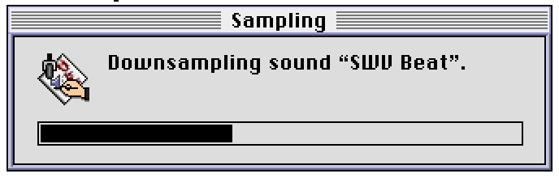
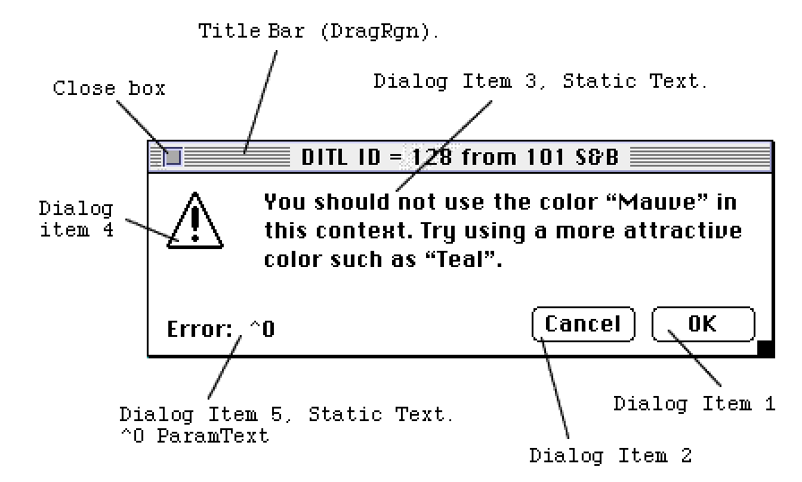

# StudioDialog XFCN
A HyperCard XFCN for displaying and controlling custom dialogs and modal progress windows.

**_Wait... what?!_** I developed this in high school as an extension to [HyperCard](http://hypercard.org) (a long-defunct program / application development environment that shipped with every Macintosh sold in the late eighties and nineties). I have archived its source code and documentation here for posterity. And nostalgia.


## Introduction

HyperCard has always given developers the ability to create "semi-custom" dialog boxes using the `ask` and `answer` commands. Now, StudioDialog allows users to create dialog boxes using standard resource compilers such as ResEdit or SaRez for use in HyperCard. In addition, StudioDialog supports progress boxes to give visual feedback of the progress of a task.

## Requirements

* HyperCard version 2.1.0 or better.

## Error Codes

Error Code | Description
-----------|------------
`(Error 800) Bad DITL Resource. Item 1 must be a valid "Push Button"` | When creating an alert box, the first item in the DITL must be a push button acting as an "OK" statement. This control will have a default outline drawn around it, and respond to the user pressing "Enter".
`(Error 801) Bad DITL Resource. Item 2 must be a "Push Button"` | When creating an alert box, the second item in the DITL must be a push button generally acting as a Cancel. This control will respond to the user pressing "period (.)".
`(Error 802) Bad DITL Resource. Item 1 must be a "UserItem"` | When creating a "progress meter" DITL item 1 must be a userItem specifying the rectangle coordinates that StudioDialog will use to draw the thermometer.
`(Error 803) Couldn't load the DLOG template resource, check the ID number.` | StudioDialog could not draw the dialog. This may be caused by a damaged resource. Check the id number passed to StudioDialog.
`(Error 804) StudioDialog general failure` | An unknown error, or multiple errors occurred when executing StudioDialog.

## SYNTAX

For progress dialog boxes:

```
StudioDialog(‘Progress’,DLOGid,WindowName,[Text1],[Text2],[Text3], [Text4])
```

For alert boxes:

```
StudioDialog(DLOGid,[Text1],[Text2],[Text3],[Text4])
```

For low level exits:

```
StudioDialog(Kill)
```

StudioDialog will return the number of the dialog item (button) hit when using a 	StudioDialog alert box. If StudioDialog cannot create the dialog an error code is 	returned.


### For alert boxes

```
Get StudioDialog(DLOGid,[Text1],[Text2],[Text3],[Text4])
```

Parameter | Description
----------|------------
`DLOGid` | Contains a valid id for a dialog box created with a resource compiler such as ResEdit or SaRez. If the string passed in DLOGid is not a valid dialog, or its resource cannot be found, an error code will be returned as the result of StudioDialog.
`Text1`	| Contains the string to be displayed in the ParamText `^0` of the alert. If the dialog does not contain any static text containing `^0` this parameter is ignored.
`Text2` | Contains the string to be displayed in the ParamText `^1` of the alert. If the dialog does not contain any static text containing `^1` this parameter is ignored.
`Text3`	| Contains the string to be displayed in the ParamText `^2` of the alert. If the dialog does not contain any static text containing `^2` this parameter is ignored.
`Text4` | Contains the string to be displayed in the ParamText `^3` of the alert. If the dialog does not contain any static text containing `^3` this parameter is ignored.

__WARNING__

StudioDialog automatically draws a bold outline around 				dialog item 1. Therefore, DITL item 1 MUST be an enabled 				button. StudioDialog may crash otherwise.

__NOTE__ 	

StudioDialog accepts any valid window definition procedure. However it treats all windows (regardless of style) as a model dialog box. Those windows containing a `dragRgn` can be relocated. Similarly, a window with a close box may be dismissed from it. If the user dismisses the window from the close box, 2 will be returned as its result (same as if user hits Cancel).

### Special Considerations:

If you create a dialog using a procedure other than the standard modeless 		dialog, you may give it a title (see figure 1) to be drawn in the title bar by 		specifying one in the resource. Available in ResEdit 2.0 under "Set DLOG Characteristics..."

__EXAMPLE__

Displaying a dialog created in ResEdit with an id of 128 containing the strings		"Testing Text 1", and "Testing Text 2"

```
Get StudioDialog(128,"Testing Text 1","Testing Text 2")
```

### For progress boxes

```
StudioDialog(‘Progress’,DLOGid,WindowName,[Text1],[Text2],[Text3], [Text4])
```

Parameter | Description
----------|------------
`DLOGid` | Contains a valid id for a dialog box created with a resource compiler such as ResEdit or SaRez. If the string passed in `DLOGid` is not a valid dialog, or its resource cannot be found, an error code will be returned as the result of StudioDialog.
`WindowName` | Contains the string to be used as the title of the window. Note that this is the same name that HyperCard will use to distinguish the window when setting window properties.
`Text1` |	Contains the string to be displayed in the ParamText `^0` of the alert. If the dialog does not contain any static text containing `^0` this parameter is ignored.
`Text2`	| Contains the string to be displayed in the ParamText `^1` of the alert. If the dialog does not contain any static text containing `^1` his parameter is ignored.
`Text3`	| Contains the string to be displayed in the ParamText `^2` of the alert. If the dialog does not contain any static text containing `^2` this parameter is ignored.
`Text4`	| Contains the string to be displayed in the ParamText `^3` of the alert. If the dialog does not contain any static text containing `^3` this parameter is ignored.

__EXAMPLE:
__

Displaying a progress dialog entitled "Sequencing the playlist" id 128 with the static text "Determining which sounds to use".

```
Get StudioDialog(PROGRESS,128,"Sequencing the playlist","Determining which sounds to use")
```

__PROPERTIES:__

You can adjust the level of progress shown in the dialog by calling:

```
Set the progress of window windowName to progressLevel.
```

Where:

`WindowName`	Indicates the title of the window. Must be the same as the title passed to StudioDialog in parameter 3.

`ProgressLevel`	Indicates the percentage of the progress bar to be filled as represented by an integer. To set the progress bar to indicate 75% set the parameter to 75.

__EXAMPLE:__

Setting the progress meter to 40% of the progress window "Sampling".

```
Set the progress of window Sampling to 40.
```



__SPECIAL CONSIDERATIONS:__

The algorithm used in StudioDialog does not support decreasing the progress of a window. Therefore the call Set the progress of window "sampling" to 20 would have no effect on the window in figure 1.

The figure below shows a dialog box under construction in ResEdit.



## Exiting HyperCard

Developers may use StudioDialog to quit HyperCard in emergency situations.  		

Use may use `KILL` to emulate the "quit" button in an application died dialog. `KILL` will cause HyperCard to quit to the Finder without doing any standard close procedures such as passing "CloseCard" or "Quit" messages. In addition `KILL` should only be used in "crash" situations since the Stack may become corrupted.
